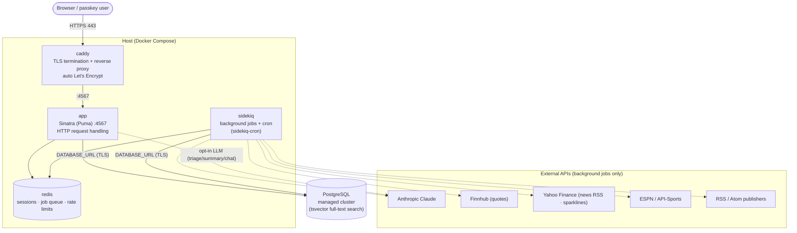
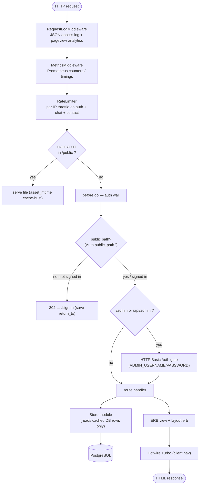
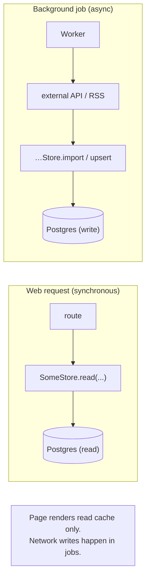
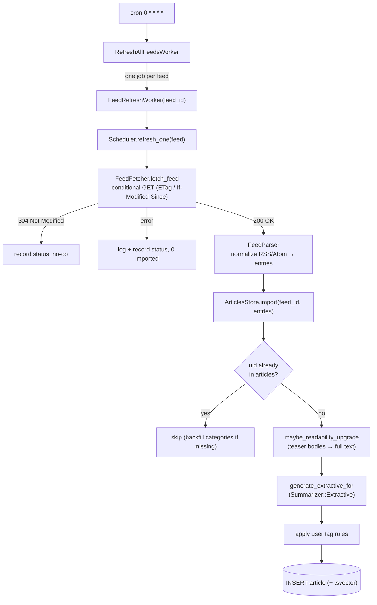
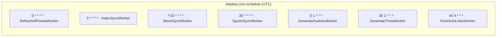
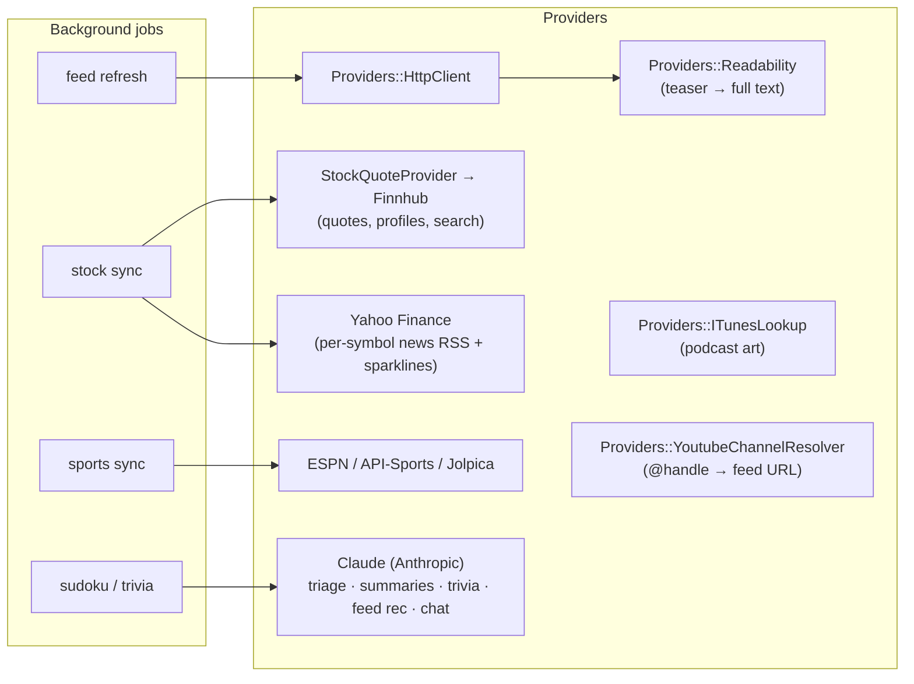
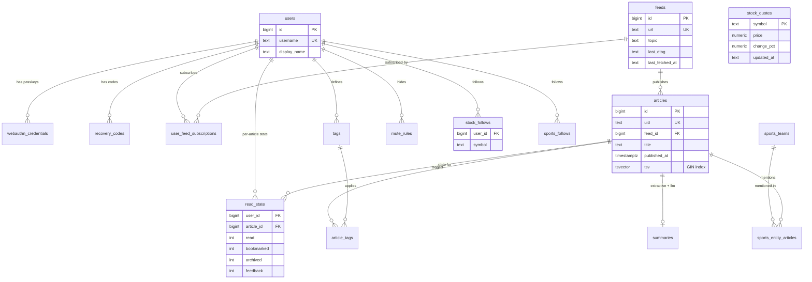

# Architecture

How Tech Feed Reader (“Feeder”) is put together: the runtime topology, how a
request flows, how feeds become articles, what runs on a schedule, and the data
model. Diagrams are [Mermaid](https://mermaid.js.org/) and render on GitHub.

For the *why* (product goals / non-goals) see [SPEC.md](../SPEC.md); for working
conventions and gotchas see [AGENTS.md](../AGENTS.md); for the page/route
inventory see [README.md](../README.md).

> **One-line summary:** a single Sinatra app + a Sidekiq worker, both reading and
> writing one PostgreSQL database, fronted by Caddy for TLS. The web process only
> ever reads cached rows; all network I/O to the outside world happens in
> background jobs. This is the **cache-only render contract** and it is the most
> important rule in the codebase.

---

## 1. Runtime topology

Four containers on one host, orchestrated by Docker Compose, plus a managed
PostgreSQL database. Caddy terminates TLS and reverse-proxies to the app.

- **`app`** and **`sidekiq`** run the *same image* with different commands
  ([Dockerfile](../Dockerfile), [docker-compose.yml](../docker-compose.yml)). The
  app is a Sinatra app on Puma listening on `:4567`; sidekiq runs the workers
  plus the cron schedule.
- **`redis`** holds signed-cookie session backing, the Sidekiq queue, and
  per-IP rate-limit buckets.
- **PostgreSQL** is a managed cluster reached over TLS via `DATABASE_URL`. It is
  the single source of truth; full-text search uses a generated `tsvector`
  column with a GIN index ([app/database.rb](../app/database.rb)).
- The web process talks to Anthropic **only** for explicitly user-triggered LLM
  actions (a triage run, a “summarize with Claude” click, the chat widget) —
  everything else external is a background job.

---

## 2. Request lifecycle

Every request passes through a short Rack middleware stack and a `before` filter
(the auth wall) before reaching a route. Routes read cached rows from a Store and
render an ERB view inside [views/layout.erb](../views/layout.erb); the browser
uses Hotwire Turbo for navigation.

Key points ([app/main.rb](../app/main.rb)):

- The middleware stack is assembled with `Rack::Builder` at the bottom of
  `app/main.rb`: `RequestLogMiddleware` → `MetricsMiddleware` → `RateLimiter` →
  the Sinatra app. `/admin/sidekiq` (the Sidekiq web UI) is mounted alongside.
- The **auth wall** is a single `before do` filter. Unauthenticated requests to
  protected paths get a 302 to `/sign-in` (stashing `return_to`). In `RACK_ENV=test`
  the wall is off and every request implicitly adopts user 1, which is why specs
  don’t need a sign-in dance.
- `/admin/*` and `/api/admin/*` sit behind an **additional** HTTP Basic Auth gate
  on top of the passkey session.
- Auth is **passwordless** — WebAuthn / passkeys, with one-time recovery codes
  ([app/auth.rb](../app/auth.rb), `UsersStore`, `WebAuthnCredentialsStore`,
  `RecoveryCodesStore`).

---

## 3. The store layer & the cache-only contract

Every table (or cluster of related tables) is wrapped by a `module …Store` in
[app/](../app/) that owns its SQL. Routes call stores; **stores never call the
network**. The web process renders only what is already cached in Postgres.

Representative stores (one table-cluster each):

| Domain | Stores |
|---|---|
| Feeds & articles | `FeedsStore`, `ArticlesStore`, `ReadStateStore`, `SummaryStore`, `TagsStore`, `MuteRulesStore`, `FeedFeedbackStore` |
| AI surfaces | `TriageStore`, `DigestStore`, `LlmUsageStore` |
| Sports | `SportsLeaguesStore`, `SportsTeamsStore`, `SportsPlayersStore`, `SportsMatchesStore`, `SportsStandingsStore`, `SportsFollowsStore`, `SportsEntityArticlesStore` |
| Stocks | `StockFollowsStore`, `StockQuotesStore` (+ the `StockNewsFeed` symbol→RSS mapper) |
| Games / radio | `Games::SudokuStore`, `Games::TriviaStore`, `RadioStore` |
| Auth & ops | `UsersStore`, `WebAuthnCredentialsStore`, `RecoveryCodesStore`, `PageviewsStore`, `SupportMessagesStore` |

All of them go through the single connection in
[app/database.rb](../app/database.rb) (`Database.connection` →
`Database::PgAdapter`). Migrations are plain SQL files applied in filename order
from [db/migrations-postgres/](../db/migrations-postgres/) by `Database.migrate!`
(runs on app boot in dev/prod; tests migrate a disposable DB themselves).

> **Why it matters:** a page load must never block on a publisher’s slow server
> or an API rate limit. If you add a route, read cache; if you need fresh data,
> enqueue a worker. The one sanctioned exception is a *user-initiated* LLM action,
> which is explicit and quota-guarded.

---

## 4. Feed → article ingestion pipeline

The hourly cron fans out one job per feed. Each job fetches conditionally
(ETag / Last-Modified), parses RSS/Atom to a normalized shape, and imports —
deduping on a stable `uid`, optionally upgrading teaser bodies via Readability,
and generating an extractive summary.

Files: [app/workers/refresh_all_feeds_worker.rb](../app/workers/refresh_all_feeds_worker.rb),
[app/workers/feed_refresh_worker.rb](../app/workers/feed_refresh_worker.rb),
[app/scheduler.rb](../app/scheduler.rb), [app/feed_fetcher.rb](../app/feed_fetcher.rb),
[app/feed_parser.rb](../app/feed_parser.rb), [app/articles_store.rb](../app/articles_store.rb).

The same pipeline powers **stock news**: a followed symbol maps to a Yahoo
Finance per-symbol RSS feed ([app/stock_news_feed.rb](../app/stock_news_feed.rb)),
so its headlines flow into `articles` like any other feed and surface in
`/articles` and the home page. See §7.

---

## 5. Background jobs & schedule

Sidekiq runs the workers; [config/sidekiq_cron.yml](../config/sidekiq_cron.yml)
declares the recurring jobs (UTC).

| Schedule | Worker | Purpose |
|---|---|---|
| `0 * * * *` (hourly) | `RefreshAllFeedsWorker` | Fan out one `FeedRefreshWorker` per feed |
| `5 * * * *` | `IndexSyncWorker` | Refresh quotes for the 10 major world indices |
| `*/15 * * * *` | `StockSyncWorker` | Refresh cached quotes for all followed symbols (Finnhub) |
| `30 * * * *` | `SportsSyncWorker` | ESPN/API-Sports schedules, standings, tennis rankings |
| `0 1 * * *` | `GenerateSudokuWorker` | Pre-generate the next 7 days of puzzles |
| `30 1 * * *` | `GenerateTriviaWorker` | Build today’s News Trivia from the last 24h of articles (Claude) |
| `45 4 * * *` | `FixArticleLinksWorker` | Re-scrub any `content_scrubbed = FALSE` article HTML |

On-demand workers also exist: `FeedRefreshWorker` (single feed — also enqueued
when you first view/follow a cold stock symbol), `StockQuoteFetchWorker` (eager
quote on follow), `SportsTeamFetchWorker` (index articles for one team).

---

## 6. External providers

All under [app/providers/](../app/providers/) plus the Claude integrations.
Each degrades gracefully when its key is unset.

Claude usage is gated by [app/llm_guard.rb](../app/llm_guard.rb) (`LlmGuard`):
a per-user 24h token budget plus a global hourly circuit-breaker, and every call
is recorded in `LlmUsageStore`. Models default to the latest Claude family
(triage on Sonnet, summaries on Opus) — see [AGENTS.md](../AGENTS.md).

---

## 7. Data model (core entities)

Abridged to the load-bearing relationships; see
[db/migrations-postgres/](../db/migrations-postgres/) for full column lists.

Other domains follow the same shape: `sports_leagues / teams / players / matches /
standings`, `sudoku`, `trivia`, `radio_stations / radio_follows`, `digests`,
`triages`, `pageviews`, `llm_usage`, `feed_feedback`.

---

## 8. Feature domains

Each maps to a route group in [app/main.rb](../app/main.rb) and a Store. See the
[README pages table](../README.md#pages) for the full route inventory.

- **Feeds & articles** — `/articles`, `/feeds`, `/article/:uid`, `/search`,
  `/bookmarks`, `/tags`; tagging, mute rules, For-You relevance ranking,
  `tsvector` full-text search.
- **Podcasts & YouTube** — `/podcasts`, `/youtube`; a persistent mini-player that
  survives Turbo navigation; bulk `@handle` resolution.
- **Sports** — `/sports*`; followed teams/players/leagues, standings, calendar
  (iCal), and “articles mentioning <entity>” surfaces via `SportsEntityArticlesStore`.
- **Stocks** — `/stocks`, `/stocks/:symbol`, `/stocks/:symbol/news`; Finnhub
  quotes, Yahoo sparklines + per-symbol news, a global ticker on every signed-in
  page (the `ticker_quotes` helper + [views/_stock_ticker.erb](../views/_stock_ticker.erb)).
- **Games** — `/games/sudoku`, `/games/trivia`; pre-generated daily.
- **Comics / Radio / NPR / PBS** — `/comics`, `/radio`, `/npr`, `/pbs`.
- **AI** — `/triage`, `/digests`, the chat widget, and the `/feeds` AI recommender;
  all quota-guarded.
- **Auth & admin** — passkey `/sign-up` / `/sign-in` / `/account`; `/admin/*`
  behind Basic Auth; `/health` + `/metrics` for ops.

---

## 9. Deploy pipeline

Releases are tag-driven. `make deploy-{patch,minor,major}` bumps `VERSION`,
commits, tags, and pushes; pushing a `v*` tag triggers GitHub Actions, which runs
the suite, builds a `linux/amd64` image, pushes it to the DigitalOcean Container
Registry, and SSHes the host to recreate the `app` + `sidekiq` containers.

```mermaid
flowchart LR
    dev["make deploy-minor<br/>(laptop)"] --> bump["bump VERSION + tag v0.x.0"] --> push["git push tag"]
    push --> gha["GitHub Actions (deploy.yml)"]
    gha --> test["RSpec (Postgres service)"]
    test --> build["docker buildx (linux/amd64)"]
    build --> docr[("DigitalOcean<br/>Container Registry")]
    docr --> ssh["ssh deploy@host<br/>cd /opt/app && make deploy"]
    ssh --> recreate["docker compose up -d<br/>--force-recreate app sidekiq"]
    recreate --> live([production live])
```

- `caddy` and `redis` stay up across a deploy — only `app` + `sidekiq` are
  recreated, so there’s no TLS-cert blip or queue flush
  ([Makefile](../Makefile) `deploy` target, [.github/workflows/deploy.yml](../.github/workflows/deploy.yml)).
- Rollback: pin `IMAGE_TAG=<version>` in the host’s `.env` and re-run `make deploy`.
- One-off data jobs run inside the container, e.g.
  `docker compose exec app bundle exec ruby scripts/<script>.rb`.
- Full runbook: [DEPLOYMENT.md](../DEPLOYMENT.md).

---

## Where to read next

| You want… | Read |
|---|---|
| Product goals / non-goals | [SPEC.md](../SPEC.md) |
| Conventions, caching contract, gotchas | [AGENTS.md](../AGENTS.md) |
| Route / page inventory | [README.md](../README.md) |
| How to contribute | [CONTRIBUTING.md](../CONTRIBUTING.md) |
| Production runbook | [DEPLOYMENT.md](../DEPLOYMENT.md) |
